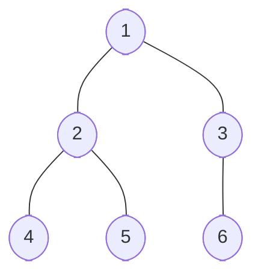
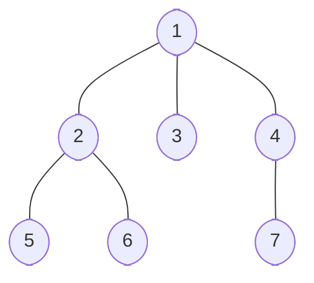

## Intro

**Tree** data structures possess an impressive versatility that allows them to tackle many complex problems. For instance, managing hierarchies of employees in a large organization or efficiently storing words in a spell-checking system — these real-world scenarios naturally form tree-like structures!

## Conceptual Overview: Binary and Non-Binary Trees

Starting with a brief overview, a **Tree** in computer science is a non-linear data structure representing a hierarchical and connected arrangement of entities known as nodes. A **Binary Tree** is a specific type of **Tree** data structure where each node has, at most, two children: one left child and one right child.

On the other hand, a **Non-Binary Tree**, also known as a **Multi-Way Tree**, can have more than two children per node.

Before we jump into **Tree** implementation, let's familiarize ourselves with key concepts and facts about **Tree** data structures essential for beginners learning about **Trees**.

### Terminology

- **Root**: The topmost **Node** in a **Tree**.
- **Edge**: The connection between one **Node** to another.
- **Leaf**: A **Node** that doesn't have any children.
- **Depth of a Node**: The number of **Edges** from the **Node** to the **Tree's** root **Node**.
- **Height of a Tree**: The maximal depth of the **Tree** **Nodes**.
- **Subtree**: Any **Node** and its descendants form a subtree of the original **Tree**.

### Tree Properties

- **Path**: A sequence of **Nodes** and **Edges** connecting a **Node** with a descendant.
- **Acyclic**: **Trees** cannot have cycles, which are **Paths** where the start and end points are the same.
- **Connected**: All **Nodes** in a **Tree** are connected by **Paths**.
- <em class="math">E = V − 1</em>: For any **Tree** the number of **Edges** (<em class="math">E</em>) is always one less than the number of vertices (<em class="math">V</em>), illustrating the tree's connectivity without cycles.

## Implementation of Binary and Non-Binary Trees

Now that we've refreshed our understanding of what **Binary and Non-Binary Trees** are, let's illustrate how to implement them using Python. In Python, **Tree** structures can be constructed using class-based representations.

Consider the **Binary Tree**. Below is the `Node` class, representing a single node in a binary tree. Each `Node` object can hold a value and has two pointers, `left` and `right`, initially set to `None`.

```python
class Node:
    def __init__(self, value):
        self.value = value
        self.left = None
        self.right = None

```

For a **Non-Binary Tree**, we can use a list to hold the **Links** to the child **Nodes** since their number isn't fixed.

```python
class Node:
    def __init__(self, value):
        self.value = value
        self.children = []

```

### Example: Binary Tree

In order to gain a practical understanding of the concepts presented so far, let's take a look at some examples of **Binary and Non-Binary Trees** along with their traversals.

For our **Binary Tree**, let's use a simple structure with three levels of vertices.



```python
root = Node(1)
root.left = Node(2)
root.right = Node(3)
root.left.left = Node(4)
root.left.right = Node(5)
root.right.right = Node(6)
```

### Example: Non-Binary Tree

As for the **Non-Binary Tree**, we demonstrate a simple tree with three levels.



```python
root = Node(1)
root.children.extend([Node(2), Node(3), Node(4)])
root.children[0].children.extend([Node(5), Node(6)])
root.children[2].children.extend([Node(7)])
```

## Binary Tree Traversal

Trees are dynamic data structures permitting several operations, such as **insertion** _(adding a new **Node**)_, **deletion** _(removing an existing **Node**)_, and **traversal** _(accessing or visiting all **Nodes** in a specific order)_.

**Traversal** of the **Binary Tree** is a process of visiting all **Nodes** of a **Tree** and possibly printing their values. Since all **Nodes** are connected via **edges** _(links)_, we always start from the **root** _(head)_ **Node**. We cannot randomly access a **Node** in a **Tree**. There are three ways to traverse a **Tree**:

- **In-order Traversal**: In this method, the left subtree is visited first, then the root, and later the right subtree. We should always remember that every **Node** may represent a subtree itself.
- **Pre-order Traversal**: In this method, the root **Node** is visited first, then the left subtree, and finally the right subtree.
- **Post-order Traversal**: In this method, the root **Node** is visited last, hence the name. We first traverse the left subtree, then the right subtree, and finally, the root **Node**.

Here is how the in-order traversal implementation may look like:

```python
root = Node(1)
root.left = Node(2)
root.right = Node(3)
root.left.left = Node(4)
root.left.right = Node(5)
root.right.right = Node(6)


def in_order_traversal(node):
    if node is None:
        return
    in_order_traversal(node.left)
    print(f"{node.value} -> ", end='')
    in_order_traversal(node.right)


in_order_traversal(root)
# Output: 4 -> 2 -> 5 -> 1 -> 3 -> 6 ->
```

## Tree Operations: Insertion and Deletion

Usually, information is inserted into a **Tree** as a **Node**. In a **Binary Tree**, a new **Node** is inserted as the left or the right child of an existing **Node**. An algorithm for inserting a **Node** can be established by identifying an appropriate location for the new **Node**. Deleting a **Node** from a **Tree** structure requires identifying the **Node**, studying its properties, and subsequently transforming the **Tree** structure.

Here's how our tree definitions look with these operations implemented:

```python
class TreeNode:
    def __init__(self, value):
        self.value = value
        self.children = []

    def add_child(self, child_node):
        self.children.append(child_node)

    def remove_child(self, child_node):
        self.children = [child for child in self.children if child is not child_node]

```

## Complexity Analysis: Binary and Non-Binary Trees

For **Binary Trees**, the worst-case time complexity for **searching**, **insertion**, or **deletion** is <em class="math">O(log n)</em>, where <em class="math">n</em> is the number of nodes. This complexity arises because, in the worst case, you might have to traverse all **Nodes**. However, in ideal circumstances _(where the **Tree** is perfectly balanced)_, operations on **Binary Trees** run in <em class="math">O(log n)</em> time.

Comparatively, for **Non-Binary Trees**, **searching** for or **deleting** a **Node** can still be <em class="math">O(n)</em>, but **insertion** may be more efficient — <em class="math">O(1)</em> — if we keep track of where the next **insertion** should happen; if we don't, the complexity is the same as in **Binary Tree**.

## Examples

### Browsing History as a Tree

```python
class TreeNode:
    def __init__(self, value):
        self.value = value
        self.children = []

    def add_child(self, child_node):
        self.children.append(child_node)

    def remove_child(self, child_node):
        self.children = [
            child for child in self.children if child is not child_node
        ]


# Create a Browser History as a Non-Binary Tree
browser_history_root = TreeNode("HomePage")

google = TreeNode("Google.com")
youtube = TreeNode("Youtube.com")
codesignal = TreeNode("CodeSignal.com")

browser_history_root.add_child(google)
browser_history_root.add_child(youtube)
browser_history_root.add_child(codesignal)

# Let's add some more
gmail = TreeNode("Gmail.com")
google.add_child(gmail)

codesignal_tour = TreeNode("CodeSignal.com/Tour")
codesignal_blog = TreeNode("CodeSignal.com/Blog")
codesignal.add_child(codesignal_tour)
codesignal.add_child(codesignal_blog)


# Function to print the Browser History Tree (i.e., Pre-order traversal)
def print_history(node):
    if node is None:
        return

    print(f'Visited -> {node.value}')
    for child in node.children:
        print_history(child)


print_history(browser_history_root)

# Visited -> HomePage
# Visited -> Google.com
# Visited -> Gmail.com
# Visited -> Youtube.com
# Visited -> CodeSignal.com
# Visited -> CodeSignal.com/Tour
# Visited -> CodeSignal.com/Blog
```

### Print Binary Tree In-Order

```python
class TreeNode:
    def __init__(self, value):
        self.value = value
        self.left = None
        self.right = None


binary_tree_root = TreeNode('Root')

A = TreeNode('A')
binary_tree_root.left = A
Z = TreeNode('Z')
binary_tree_root.right = Z

aB = TreeNode('aB')
A.left = aB
aC = TreeNode('aC')
A.right = aC

zX = TreeNode('zX')
Z.left = zX
zY = TreeNode('zY')
Z.right = zY


def print_in_order(node):
    if node is None:
        return

    print_in_order(node.left)
    print(f'Visited -> {node.value}')
    print_in_order(node.right)


print_in_order(binary_tree_root)

```
