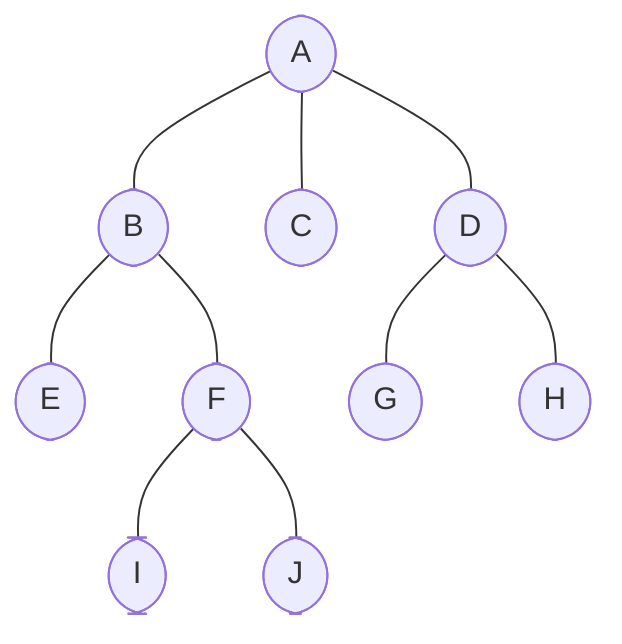

## Understanding Depth-first Search

How would you explore an uncharted forest? Where would you begin? Would you inspect each pathway at ground level before climbing a tree, or would you ascend the first tree you encounter, climbing as high as possible before descending? The latter approach mirrors the strategy that the **Depth-first Search (DFS)** algorithm uses when exploring **Trees** or **Graphs**.

Essentially, **DFS** is a **Tree traversal technique** that seeks to explore as far down a pathway _(or to as great a depth)_ as possible before returning _(or backtracking)_. Instead of splitting its focus over multiple pathways concurrently, **DFS** concentrates on exploring one pathway as thoroughly as possible before retreating to explore other pathways. Here's another real-world analogy for **DFS**: consider how you might navigate a labyrinth; you'd follow a twisting, turning path to its end before backtracking to explore another path. This principle lies at the heart of **DFS** — explore the depth before the breadth!

## The DFS Algorithm at a Glance

A journey of a thousand miles begins with a single step. For **DFS**, that first step is the root node of the tree _(or an arbitrary node chosen as the root when dealing with a graph)_. Let's closely examine the stages involved in conducting a **DFS**:

1. The **DFS** algorithm starts at the root node, marking it as visited.
2. For every child node of the starter node:
      - If the child hasn't been visited, the algorithm recursively executes from the child node.
      - If the child has already been visited, the algorithm skips this node and proceeds to the next child.
3. The algorithm automatically finishes when all achievable nodes have been visited.

## DFS in Action: Python Implementation

Now that we understand the **DFS** algorithm let's translate it into Python code. For simplicity, we have prepared an example of the tree:



Here is a `dfs` implementation in Python:

```python
def dfs(tree, root, visited, traversal):
    traversal.append(root)
    visited.add(root)

    for child in tree[root]:
        if child not in visited:
            dfs(tree, child, visited, traversal)

    return root


tree = {
  'A': ['B', 'C', 'D'],
  'B': ['A', 'E', 'F'],
  'C': ['A'],
  'D': ['A', 'G', 'H'],
  'E': ['B'],
  'F': ['B', 'I', 'J'],
  'G': ['D'],
  'H': ['D'],
  'I': ['F'],
  'J': ['F'],
}
visited = set()
traversal = []
dfs(tree, 'A', visited, traversal)

print(' -> '.join(traversal))
```

In this implementation, we represent the **Tree** using a Python dictionary where each key is a **Node**, and its corresponding value is a list of adjacent **Nodes**. Notice that this representation includes bidirectional connections _(for instance, `'A'` lists `'B'` as a child, and `'B'` lists `'A'` as a child)_. While this might seem redundant for a **Tree** where we typically only care about parent-to-child relationships, this representation allows our DFS implementation to work correctly regardless of the direction we traverse. The visited set ensures we don't revisit **Nodes** we've already seen, preventing infinite loops that could occur due to these bidirectional connections.

## DFS Time and Space Complexity

Understanding an algorithm's efficiency is a crucial aspect of comprehending any algorithm. Efficiency includes time and space complexity, both of which consider how running time or memory space used by an algorithm increases with the input size.

For **DFS**, the time complexity is <em class="math">O(V + E)</em>, where <em class="math">V</em> represents the number of **Vertices** _(or **Nodes**)_, and <em class="math">E</em> represents the number of **Edges**. **DFS** needs to visit every **Edge** and **Vertex** at least once, which dictates its time complexity. For **Trees** specifically, as <em class="math">E = V − 1</em>, the `dfs` time complexity is <em class="math">O(V)</em>.

The space complexity of **DFS** is <em class="math">O(V)</em>.

## DFS Application: Solving Complex Problems

Practical application solidifies theoretical understanding. **DFS** is used extensively to solve complex problems related to connected components, topological sorting, and detecting cycles, among other issues. For example, if we need to find a path from node `'A'` to `'J'` in our tree above, **DFS** can identify such a path.

```python
def find_path(tree, start, end, visited, path=[]):
    path = path + [start]
    visited.add(start)

    if start == end:
        return path

    for node in tree[start]:
        if node not in visited:
            new_path = find_path(tree, node, end, visited, path)
            if new_path:
                return new_path
    return None


visited = set()
print(find_path(tree, 'A', 'J', visited))
# Output: ['A', 'B', 'F', 'J']
```

## Examples

### Traversing Company's Departmental Structure

```python
class Node:
    def __init__(self, value):
        self.value = value
        self.children = []


def add_edges(tree, node, child_values):
    for value in child_values:
        node.children.append(Node(value))


def dfs(node, visited=None):
    if visited is None:
        visited = set()

    visited.add(node.value)
    print(node.value, end=' -> ')

    for child in node.children:
        if child.value not in visited:
            dfs(child, visited)


# Constructing a tree
root = Node('Head Office')
add_edges(root, root, ['Marketing', 'Sales', 'R&D'])

node_marketing = root.children[0]
add_edges(root, node_marketing, ['SEO', 'Content'])

node_sales = root.children[1]
add_edges(root, node_sales, ['Domestic', 'International'])

# Perform DFS traversal
print("DFS Traversal:")
dfs(root)
print("end")

# DFS Traversal:
# Head Office -> Marketing -> SEO -> Content -> Sales -> Domestic -> International -> R&D -> end
```

### Traversing Earth's Continents and Countries

```python
class Node:
    def __init__(self, value):
        self.value = value
        self.children = []

    def add_child(self, child_value):
        self.children.append(Node(child_value))

    def depth_first_search(self, visited=None):
        if visited is None:
            visited = set()
        visited.add(self.value)
        print(self.value, end=' -> ')
        for child in self.children:
            if child.value not in visited:
                child.depth_first_search()


# Construct an imitation of a planet hierarchy
root_node = Node('Earth')
root_node.add_child('Africa')
root_node.add_child('Asia')

# Expand upon the countries in Africa
africa = root_node.children[0]
africa.add_child('Nigeria')
africa.add_child('South Africa')
africa.add_child('Egypt')
africa.add_child('Congo')

# Expand upon the countries in Asia
asia = root_node.children[1]
asia.add_child('China')
asia.add_child('India')
asia.add_child('Mongolia')
asia.add_child('Russia')

# Perform a depth-first search traversal starting from the root node
print("DFS Traversal of Planet's Continents:")
root_node.depth_first_search()
print("end")

# DFS Traversal of Planet's Continents:
# Earth -> Africa -> Nigeria -> South Africa -> Egypt -> Congo -> Asia -> China -> India -> Mongolia -> Russia -> end
```

### Creating and Traversing City Areas

```python
class Area:
    def __init__(self, name):
        self.name = name
        self.subareas = []

    def add_subarea(self, area):
        self.subareas.append(area)

    def dfs_traversal(self, node=None, visited=None, depth=0):
        if node is None:
            node = self

        if visited is None:
            visited = set()

        print(f"{('-' * (depth * 4)) + ' ' if depth > 0 else ''}{node.name}")
        visited.add(node)

        next_depth = depth + 1
        for sub in node.subareas:
            if sub not in visited:
                self.dfs_traversal(sub, visited, next_depth)


root_area = Area('City Center')
financial_district = Area('Financial District')
north_side = Area('North Side')
south_side = Area('South Side')

root_area.add_subarea(financial_district)
root_area.add_subarea(north_side)
root_area.add_subarea(south_side)

financial_district.add_subarea(Area('Big Ol Bank'))
financial_district.add_subarea(Area('Stock Bro Buildings'))

north_side.add_subarea(Area('Italian Market'))
north_side.add_subarea(Area('City Hall'))
north_side.add_subarea(Area('DMV'))

south_side.add_subarea(Area('Chinatown'))
south_side.add_subarea(Area('Gigantic Park'))


print('DFS Traversal of City Areas')
print('=' * 111)
root_area.dfs_traversal()
print(f"{'=' * 50}    END    {'=' * 50}")

# DFS Traversal of City Areas
# ===============================================================================================================
# City Center
# ---- Financial District
# -------- Big Ol Bank
# -------- Stock Bro Buildings
# ---- North Side
# -------- Italian Market
# -------- City Hall
# -------- DMV
# ---- South Side
# -------- Chinatown
# -------- Gigantic Park
# ==================================================    END    ==================================================
```
