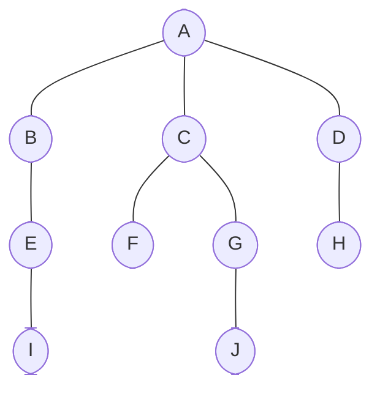

## Intro

Imagine that you're navigating your way through a network of interconnected destinations, with each destination being a **Node** in a **Tree**. **BFS** is like taking a comprehensive sightseeing tour that starts at a landmark and visits all the destinations within the immediate vicinity before moving on to the next layer of destinations. With **BFS**, you ensure you've explored all the sights at each depth before venturing further.

## Understanding the Concept of Breadth-first Search

**Breadth-first Search (BFS)** is a traversal algorithm used in **Graphs** or **Tree** structures — it's a specific way in which we can visit **Nodes**. When we talk about 'visiting' **Nodes** in **BFS**, we aim to visit **Nodes** closest to the root **Node** first before moving deeper into the **Tree**. **BFS**, compared to **Depth-first Search (DFS)**, is like exploring your neighborhood before moving on to the next town, while **DFS** would be like driving straight across the country, visiting towns en route, before coming back to your neighboring town.

**BFS** is an intuitive method that can form the basis for many algorithms in _graph theory_. For example, it is leveraged in algorithms for finding the shortest path in unweighted **Graphs**, network broadcasting, and games and puzzles such as the Rubik's cube.

## Visualizing Breadth-first Search

Let's create a visualization to illustrate the **BFS** technique. Imagine a **Tree** structure representing a family lineage — a root **Node** representing an ancestor and subsequent layers representing descendant generations. Starting from the ancestor, a **BFS** traversal visits all their immediate offspring before moving on to the grandchildren, then the great-grandchildren, and so on in cascading circles. This visualization helps illustrate how **BFS** explores **Nodes** — it's like taking a layered tour of a genealogical **Tree**!

A crucial aspect to consider in **BFS** is the usage of a **Queue**. The **Queue** is a data structure that holds the **Nodes** still to be visited, and it follows a **First In, First Out (FIFO)** protocol — think of it as standing in line; the first one to get in is the first one to get out.

## BFS Algorithm Explained

Conceptually, the **BFS** algorithm isn't overly complicated. It starts at the root and visits all direct children before moving deeper into the tree. The algorithm can be summed up as follows:

1. Start with the root **Node**.
2. Visit the root **Node** and add all its direct children to the **Queue**.
3. Visit each **Node** in the **Queue**, adding all its unvisited children to the **Queue**. Repeat this exercise until the **Queue** is empty.

This algorithm guarantees that every **Node** on level `L` _(on distance `L` from the root **Node**)_ will be processed _(i.e., taken from the **Queue**)_ earlier than any **Node** on level `L + 1` or further, which is what we are looking for.

This begs the question: what about the complexity of **BFS**? If all **Edges** are unweighted, **BFS** guarantees finding the shortest **Path** from the source to all reachable **Vertices**. In terms of time complexity, performing **BFS** requires inspecting all **Vertices** and **Edges**, resulting in a time complexity of <em class="math">O(V+E)</em> _(where_ <em class="math">V</em> _stands for **Vertices** or **Nodes**, and_ <em class="math">E</em> _stands for **Edges** or connections)_. As for **Trees** <em class="math">E=V−1</em>, the time complexity is <em class="math">O(V)</em>.

The space complexity would be <em class="math">O(V)</em>, as all **Vertices** end up in the **Queue**.

## Trees and BFS in Python

Before we roll up our sleeves and dive into coding, let's understand some underlying tools. To implement **BFS** in Python, we'll take advantage of Python's built-in collection `deque` to create a **FIFO Queue**. The main advantage of using `deque` from the `collections` module as a **Queue** instead of a `list` is that `deque` provides an <em class="math">O(1)</em> complexity for append and pop operations compared to a list that provides <em class="math">O(n)</em> complexity.

Here's a chunk of **BFS** code on a tree created using a dictionary where each key-value pair denotes a node and its children.

```python
from collections import deque


def BFS(tree, root):
    visited = set()  # Set to keep track of visited nodes
    visit_order = []  # List to keep visited nodes in order they are visited
    queue = deque()  # A queue to add nodes for visiting

    queue.append(root)  # Start at root

    while queue:
        node = queue.popleft()  # Visit first node in queue
        visit_order.append(node)  # and add it to list of visited nodes
        visited.add(node)  # and mark node as visited

        # Now, add all unvisited children to the queue
        for child in tree[node]:
            if child not in visited:
                queue.append(child)

    return visit_order  # Return order of visited nodes

```

## Implementing BFS on Trees: Hands-on Application

- Create a tree using a dictionary
- apply our BFS function to it



```python
# Tree definition
tree = {
  'A': ['B', 'C', 'D'],
  'B': ['A', 'E'],
  'C': ['A', 'F', 'G'],
  'D': ['A', 'H'],
  'E': ['B', 'I'],
  'F': ['C'],
  'G': ['C', 'J'],
  'H': ['D'],
  'I': ['E'],
  'J': ['G'],
}

print(BFS(tree, 'A'))
# Output: ['A', 'B', 'C', 'D', 'E', 'F', 'G', 'H', 'I', 'J']
```

## Solving Advanced Problems Using BFS and Trees

To demonstrate an advanced real-life application of **BFS** on **Trees**, consider it as a solution to find the shortest **Path** in a network of interconnected systems, whether they be cities, computer systems, or web pages. **BFS** can traverse the network in such a way that it leads to the desired destination in the shortest possible way. This algorithm can be a lifesaver when dealing with large networks as it avoids unnecessary dives into unreachable **Paths**.

The practical versatility of **BFS** on **Trees** can handle many complex problems, thereby providing optimized solutions in coding interviews and industry projects.

## Examples

### Traverse Areas in Forest

```python
from collections import deque

# Represents the forest as a dictionary
forest = {
    'Amazon_Rainforest': [
        'Congo_Basin',
        'Southeast_Asian_Rainforests'
    ],
    'Congo_Basin': [
        'Guinea_Rainforests',
        'New_Guinea_Rainforests'
    ],
    'Southeast_Asian_Rainforests': [
        'Sundaland_Rainforests',
        'Wallacea_Rainforests'
    ],
    'Guinea_Rainforests': [],
    'New_Guinea_Rainforests': ['Papua_New_Guinea_Rainforests'],
    'Sundaland_Rainforests': [],
    'Wallacea_Rainforests': ['Celebes_Rainforests'],
    'Papua_New_Guinea_Rainforests': [],
    'Celebes_Rainforests': []
}


def BFS(forest, root='Amazon_Rainforest'):
    ''' BFS algorithm to visit all forests '''
    queue = deque()  # Queue to hold forest regions
    queue.append(root)  # Starting search from root
    visited = []  # List to hold visited forests

    while queue:
        current_forest = queue.popleft()
        visited.append(current_forest)  # Mark current forest as visited

        # Queuing the forests not yet visited
        if current_forest in forest:
            for neighbouring_forest in forest[current_forest]:
                if neighbouring_forest not in visited:
                    queue.append(neighbouring_forest)

    return visited


print(' -> '.join(BFS(forest, root='Amazon_Rainforest')))  # Using Amazon Rainforest as root

# Output: Amazon_Rainforest -> Congo_Basin -> Southeast_Asian_Rainforests -> Guinea_Rainforests -> New_Guinea_Rainforests -> Sundaland_Rainforests -> Wallacea_Rainforests -> Papua_New_Guinea_Rainforests -> Celebes_Rainforests
```
