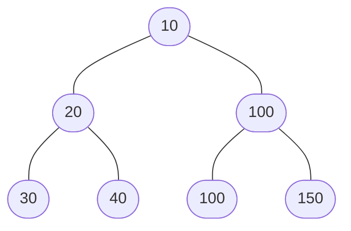

## Intro

**Heaps** are versatile data structures with applications across various domains, simplifying tasks, such as _forming efficient priority queues or sorting arrays_, and further demonstrating their relevance in solving complex mathematical and computer science problems.

## What are Heaps?

A **Heap** is a _complete binary tree_ that satisfies a special property known as the _**heap property**_.

Essentially, the _**heap property**_ stipulates that if `P` is a parent node of `C`, then:

- in the case of a **Max Heap**: the value of node `P` is either greater than or equal to the value of node `C`
- in a **Min Heap**: the value of node `P` is either lesser than or equal to the value of node `C`

In simpler terms, in a **Max Heap**, each _parent node_ is greater than or equal to its _child node(s)_, and in a **Min Heap**, each _parent node_ is less than or equal to its _child node(s)_.

For a visual representation, consider the following example of a **Max Heap**:


In the above example, the _parent nodes_ hold greater values than their respective _child nodes_, validating it as a **Max Heap**.

At the same time, the **Heap** in the example below is a **Min Heap**.



## Heap Operations

Heaps support numerous operations, such as:

1. **Insert**: Inserting a new **Node** in a **Heap** may disrupt the _**heap property**_. To maintain the _**heap property**_ after each insertion, the **Node** is swapped with the parent **Node** if the _**heap property**_ is violated. This process continues until the _**heap property**_ is retained for all **Nodes**.
2. **Delete**: The deletion of a **Node** also disrupts the _**heap property**_. After deleting a **Node**, the _**heap property**_ is restored either by swapping the **Node** with its parent, similar to the Insert operation or by swapping it with one of its children. The swapping process continues until the _**heap property**_ is retained for all **Nodes**.
3. **Extract**: Extracting the maximum _(for **Max Heap**)_ or minimum _(for **Min Heap**)_ is a constant-time operation _(<em clas="math">O(1)</em>)_, as the maximum or the minimum element is always at the root of the **Heap**.

## Heapify Operation

The "`Heapify`" method is an intriguing function used to rearrange elements in **Heap** data structures. It assists in preserving the _**heap property**_ within the **Heap**. In Python, this operation can be executed using the `heapify()` function. Here's how we can implement a **Min Heap** using a list:

```python
import heapq

min_heap = [4, 7, 2, 8, 1, 3]
heapq.heapify(min_heap)

print("Heapify method: ", min_heap)
# Output: Heapify method: [1, 4, 2, 8, 7, 3]
```

This `heapify()` function converts a regular list into a **Heap**. It rearranges the list in place to satisfy the _**heap property**_. In the resulting **Heap**, the smallest element is positioned at index `0`. But how do we program other **Heap** operations such as _extract_, _insert_, or _delete_?

## Heaps in Python - The heapq Module

Python offers a vast range of libraries, including a built-in module, `heapq`, which allows for the creation and manipulation of **Heaps** with ease.

```python
import heapq


heap = []

# Insert in heap
heapq.heappush(heap, 4)
heapq.heappush(heap, 9)
heapq.heappush(heap, 6)

print("Heap after insertion: ", heap)
# Output: Heap after insertion: [4, 9, 6]

# Delete the smallest element from the heap
heapq.heappop(heap)
print("Heap after deletion: ", heap)
# Output: Heap after deletion: [6, 9]

# Extract the smallest element
smallest = heapq.nsmallest(1, heap)[0]
print("Smallest element in the heap: ", smallest)
# Output: Smallest element in the heap: 6
```

- the `heappush(heap, ele)` function is used to insert elements while maintaining the heap invariant
- the `heappop(heap)` function deletes the smallest element
- the `nsmallest(n, iterable[, key])` function returns `n` smallest elements from the iterable or heap

## Heap Sort

**Heaps** can also be useful for efficiently sorting elements in the array. This sorting is called _**heap sort algorithm**_. This algorithm essentially splits into two basic parts:

1. Build a **MinHeap** out of the array
2. Repeatedly remove the minimum element from the **Heap** and insert it into the sorted array while ensuring the **Heap** retains the _**MinHeap property**_.

**Heap sort** is a comparison-based sorting algorithm and is _particularly efficient when dealing with large datasets_ due to its <em class="math">O(n * log n)</em> time complexity - the algorithm removes the minimal element in <em class="math">O(log n)</em> time and repeats this operation <em class="math">n</em> times.

The `heapify` function transforms our list into a **MinHeap**, and we continue extracting the minimum element until our **Heap** becomes empty, resulting in a sorted list. Let's see how Python's built-in `heapq` module simplifies _**heap-sort**_:

```python
def heap_sort(arr):
    import heapq
    heapq.heapify(arr)
    return [heapq.heappop(arr) for _ in range(len(arr))]


print(heap_sort([3, 2, 1, 7, 8, 4]))
# Output: [1, 2, 3, 4, 7, 8]
```

## Examples

### Using MinHeap to Remove Smallest Element While Maintaining Heap Property

```python
import heapq


minHeap = []


# Function to insert nodes maintaining the heap property
def insertNode(node_list):
    for node in node_list:
        heapq.heappush(minHeap, node)


# Function to delete node from heap
def deleteNode():
    try:
        return heapq.heappop(minHeap)
    except:
        return None


# insert nodes into the MinHeap
insertNode([3, 1, 4, 1, 5, 9, 2, 6, 5, 3, 5])

# print MinHeap after insertions
print("Heap after insertions: ", minHeap)

# Delete a node from MinHeap
deleteNode()

# print MinHeap after deletion
print("Heap after deleting the minimum node: ", minHeap)

# Output:
# Heap after insertions:  [1, 1, 2, 3, 3, 9, 4, 6, 5, 5, 5]
# Heap after deleting the minimum node:  [1, 3, 2, 3, 5, 9, 4, 6, 5, 5]
```

### Max Heap

```python
import heapq


maxHeap = []


# A function to insert nodes into the MaxHeap while maintaining the heap property
def insert(nodes):
    for node in nodes:
        print(f"node -> {node}")
        heapq.heappush(maxHeap, node)
        print(f"Updated heap: {maxHeap}")
    heapq._heapify_max(maxHeap)
    print(f"Max Heap after insertion: {maxHeap}")


# A function to delete the largest node from the MaxHeap
def delete():
    largest = heapq.heappop(maxHeap)
    heapq._heapify_max(maxHeap)
    print(f"Largest node removed -> {largest}")
    print(f"Max Heap after deletion of largest node: {maxHeap}")
    return largest


# Spaceships identified by the last 2 digits of their license numbers
spaceships = [28, 14, 35, 55, 68, 72, 47, 19, 11, 32]


insert(spaceships)  # Add all spacecrafts to the queue

delete() # Delete the spacecraft with the largest license number
```

### Another MinHeap Example

```python
import heapq


min_heap = []


def insert(random_numbers):
    for number in random_numbers:
        heapq.heappush(min_heap, number)
    print(f"Min Heap after inserting random numbers: {min_heap}")


def delete(mh=min_heap):
    try:
        return heapq.heappop(mh)
    except Exception:
        return None


# Random numbers generated by a hypothetic radar for a real-world simulation
randomNumbers = [23, 42, 14, 30, 27, 56, 14, 9, 5, 21, 34]

# Inserting the generated random numbers into the MinHeap
insert(randomNumbers)

# Removing the smallest numbers from the MinHeap for a real-world simulation
for i in range(15):
    minNumber = delete()
    if minNumber is None:
        print("Min Heap is empty. No numbers to delete.")
    else:
        print(
            f"Min Heap after removing the smallest number {minNumber}: {min_heap}"
        )

```
