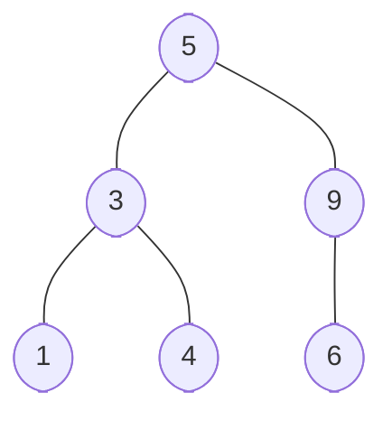

## Intro

In essence, **Binary Search Trees** are excellent data structures that _optimize search operations by appropriately arranging data elements based on certain properties_. These trees's "left-small, right-large" order property helps ensure fast search, insertion, and deletion operations. Essentially, **BSTs** are tree structures designed to make data retrieval and storage efficient and simpler.

## Understanding Binary Search Trees

**Binary Search Trees (BSTs)** are named for their binary nodal structure, where each node links to two child nodes — much like a **Binary Tree**. However, what differentiates them is a crucial property ingrained in them: _every node ensures that the values in its left subtree are less than or equal to its value, and the values in its right subtree are greater than its value_. This property facilitates highly efficient search operations.

Let's illuminate this concept with a simple instance. Take a look at the **BST** below - note that for every node, all elements in the left subtree are smaller than the node value, and all elements in the right subtree are larger than the node value.



Here, `5` sits at the root of the tree, its left subtree contains values `1`, `3`, and `4`, all less than the root value `5`, and the right subtree contains values `6` and `9`, both larger than `5`. The same condition holds for all other nodes in the tree. This simple example provides a clear insight into the underlying logic that governs the **BST's** node placement.

## Implementing Binary Search Trees in Python

Now, let's venture into the practical implementation of a **BST** in Python. We begin by defining a `Node` class. Here, a `Node` represents a structure wherein each `Node` contains a reference point to its left and right children and holds some data — the node's value.

```python
class Node:
    def __init__(self, val):
        self.left = None
        self.right = None
        self.val = val


```

## BST Operations

### Insertion

To maintain the key **BST** property during insertion, a new value `x` must be carefully positioned. We start at the root and traverse down the **BST**. If `x` is less than the current node's value, we go left; if it's greater, we move to the right child. We continue this movement until we find an appropriate spot devoid of a child node, where we place `x` in a new node at that location.

```python
class Node:
    def __init__(self, val):
        self.left = None
        self.right = None
        self.val = val


def insert(node, key):
    if node is None:
        return Node(key)

    if node.val < key:
        node.right = insert(node.right, key)
    else:
        node.left = insert(node.left, key)

    return node


```

### Searching

**Searching** will help us find if a value exists in the **BST**. We start at the root and traverse down the tree until we find the key. If the key's value is greater than a node's value, we move right, and if it's smaller, we move left. If we can't locate the key or the tree is empty, our function returns `None`, indicating that the key is not present in the **BST**.

```python
def search(node, key):
    if node is None or node.val == key:
        return node

    if node.val < key:
        return search(node.right, key)
    else:
        return search(node.left, key)


```

### Deletion

**Deleting** a node can be a bit tricky because you must maintain the **BST** property even after the deletion. A node can be deleted following these steps:

- If the node is a leaf node, delete the node outright.
- If the node has only one child: Replace the node with its subtree.
- If the node has both children: Find its in-order successor _(the smallest value in its right subtree)_ or its in-order predecessor _(the largest value in its left subtree)_ and replace the node with that value. After replacing, delete the in-order successor or predecessor node.

```python
def min_value_node(node):
    """Finds the `Node` with the smallest value in a BST."""
    current = node

    # The smallest value is located at the leftmost leaf.
    # Therefore, we iterate until the left child node is None.
    while current.left is not None:
        current = current.left
    return current


def delete_node(node, key):
    """Deletes the `Node` containing the value `key` from the BST."""
    if node is None:
        return node

    # If value `key` is less than `node`'s value, then it lies in left subtree
    if key < node.val:
        node.left = delete_node(node.left, key)
    # If value `key` is greater than `node`'s value, then it lies in right subtree
    elif key > node.val:
        node.right = delete_node(node.right, key)
    else:
        # If value `key` is equal to `node`'s value, then this is `Node` to be deleted

        # If `Node` with only one child or no child,
        # the `node`'s right child replaces the `node` if the left child does not exist
        if node.left is None:
            temp = node.right
            node = None
            return temp
        elif node.right is None:
            temp = node.left
            node = None
            return temp

        # If `node` has two children, get the inorder successor (smallest in the right subtree)
        temp = min_value_node(node.right)
        # Copy the inorder successor's content to this `node`
        node.val = temp.val
        # Delete the inorder successor
        node.right = delete_node(node.right, temp.val)

    return node

```

### Time and Space Complexity of BST Operations

Considering the time and space complexity associated with **BST** operations is essential, as it gives us a thorough understanding of the efficiency and scalability of these operations in real-world applications.

The performance of **BST** operations heavily depends on the height of the **Tree**, which is the maximum number of levels in the **Tree**. That's why **Binary Search Trees** are considered efficient data structures, as they are designed to keep the height minimal.

Here's a breakdown of the time complexity for the key **BST** operations:

- **Insertion**: The worst-case time complexity is <em class="math">O(h)</em>, where <em class="math">h</em> is the height of the **Tree**. Since we start from the root and continue to either the left or right child, depending on the **Node's** value, the time complexity is proportional to the height of the **Tree**. The best-case time complexity is <em class="math">O(log n)</em> if the **Tree** is a complete **Binary Tree** _(height is <em class="math">log n</em> in that case)_.
- **Searching**: The time complexity for the search operation, similar to insertion, is <em class="math">O(h)</em> in the worst case and <em class="math">O(log n)</em> in the best case scenario.
- **Deletion**: The worst-case time complexity for deletion is also <em class="math">O(h)</em>, considering we need to search for the **Node** to be deleted first. In the best case, it takes <em class="math">O(log n)</em> time as well.

The space complexity of all these operations is <em class="math">O(h)</em> in worst-case conditions, as during the recursive operations _(insertion, searching, or deletion)_, the auxiliary space required by the system stack is equivalent to the height of the **Tree**. However, for a perfectly balanced **Binary Search Tree**, this would be <em class="math">O(log n)</em>.

It should be noted that **BST** operations's time complexity can degrade to <em class="math">O(n)</em> in the worst-case scenario if the **BST** becomes skewed or unbalanced, meaning all nodes exist on a single side of the root, creating a linear-like structure. In practice, self-balancing **BSTs** are used to maintain an acceptable height, ensuring operations run in a relatively consistent <em class="math">O(log n)</em> time - these trees balance themselves after every insertion or deletion operation to keep the height close to <em class="math">O(log n)</em>.

## BST in the Real-World

**BSTs** have a wide range of applications. They can be used to implement an ordered map — given that you traverse them in order, it directly provides the elements sorted according to their natural order. **BSTs** can also be used to implement sets that have large arithmetic progressions efficiently. Because **BSTs** ensure a level of optimization in terms of time complexity, they're preferred for many real-life scenarios and applications.

## Examples

### Basic BST Example

```python
class Node:
    def __init__(self, val):
        self.left = None
        self.right = None
        self.val = val


def insert_BST(node: Node, target_node: Node):
    if node is None:
        node = target_node
        return
    if node.val < target_node.val:
        if node.right is None:
            node.right = target_node
        else:
            insert_BST(node.right, target_node)
    else:
        if node.left is None:
            node.left = target_node
        else:
            insert_BST(node.left, target_node)


def in_order_traversal(node: Node):
    if node:
        in_order_traversal(node.left)
        print(node.val)
        in_order_traversal(node.right)


def delete_node_with_val(node: Node, val: int):
    if node is None:
        return node
    if val < node.val:
        node.left = delete_node_with_val(node.left, val)
    elif val > node.val:
        node.right = delete_node_with_val(node.right, val)
    else:
        if node.left is None:
            temp = node.right
            node = None
            return temp
        elif node.right is None:
            temp = node.left
            node = None
            return temp
        temp = find_min_value_node(node.right)
        node.val = temp.val
        node.right = delete_node_with_val(node.right, temp.val)
    return node


def find_min_value_node(node: Node):
    current = node
    while (current.left is not None):
        current = current.left
    return current


# Driver Code:
root = Node(6)
insert_BST(root, Node(8))
insert_BST(root, Node(2))
insert_BST(root, Node(5))
insert_BST(root, Node(4))
insert_BST(root, Node(9))

print("In-order traversal:")
in_order_traversal(root)

print("In-order traversal after deleting:")
root = delete_node_with_val(root, 2)
in_order_traversal(root)

```

```python
class Node:
    def __init__(self, val: int):
        self.left = None
        self.right = None
        self.val = val

    def __str__(self):
        return f'Node({self.val})'


def insert_BST(node: Node, target_node: Node):
    if node is None:
        node = target_node


def search_BST(node: Node, value: int):
    # TODO: Perform the search for value in the BST
    pass


r = Node(50)
insert_BST(r, Node(20))
insert_BST(r, Node(70))
insert_BST(r, Node(10))
insert_BST(r, Node(30))
insert_BST(r, Node(60))
insert_BST(r, Node(80))

print(search_BST(r, 70)) # returns Node(70)
print(search_BST(r, 30)) # returns Node(30)
print(search_BST(r, 80)) # returns Node(80)
print(search_BST(r, 40)) # returns None
print(search_BST(r, 50)) # returns Node(50)
print(search_BST(r, 90)) # returns None
```
