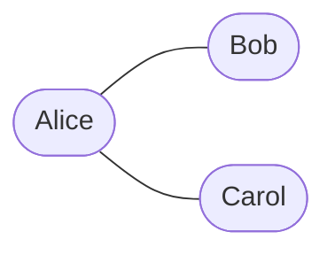
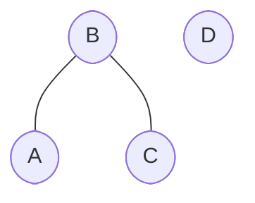

## Intro to Building a Graph with the Adjacency Matrix

This section covers

- how to construct an **Adjacency Matrix** to depict a given graph using Python
- comprehend its underlying structure
- ascertain when this particular representation becomes most advantageous

To help understand the role of an **Adjacency Matrix**, let's consider a practical scenario. Suppose you're using social media. Every time you connect with someone — by accepting their friend request, adding them back to your circle, or linking profiles — you're building a real-life graph where nodes represent users’ profiles and **Edges** signify their connections. Now, how would you represent this social network graph so that you can quickly identify who's connected to whom? This is a perfect use case for an **Adjacency Matrix** representation.

## Definition of Adjacency Matrix

So, what is an **Adjacency Matrix**? In essence, it is _a square matrix, a two-dimensional array, where each cell `(i, j)` signifies the weight of the edge between vertices `i` and `j` in the graph_. Distinct from other matrix-like representations, the most striking aspect of an **Adjacency Matrix** is _its ability to provide a concise, easy-to-understand form of visualizing and depicting the vertex connections in any given graph_.

To illustrate, let's consider a simple scenario of a small group of friends: **Alice**, **Bob**, and **Carol**. Let's say **Alice** is friends with both **Bob** and **Carol**, but **Bob** and **Carol** don't know each other. In social media terms, **Alice** would have connections with both **Bob** and **Carol**. However, **Bob's** profile would not show **Carol** as a connection, and the converse holds true as well. Let's look at this graph:



This is precisely the relation we aim to depict using an **Adjacency Matrix**. Let's create a table that shows the relationships between **Alice**, **Bob**, and **Carol**. A backtick on the intersection of a row and a column represents corresponding users are friends:

|       | Alice  | Bob  | Carol  |
|  ---  |  ---   | ---  | ---    |
| Alice |        |  ✅  |   ✅    |
| Bob   |   ✅   |      |        |
| Carol |   ✅   |      |        |

We can build the same table in Python, representing backtick as `1` and its absence as `0`:

```python
M = [
  [0, 1, 1],
  [1, 0, 0],
  [1, 0, 0],
]
```

## Building an Adjacency Matrix

So, how do we go about building an **Adjacency Matrix** more generally? In the simplest terms, we begin by setting the size of the **Matrix** equal to the number of **Vertices** in the **Graph**. Each **Cell** in the **Matrix** translates into a possible **Edge** in the **Graph**. By traversing the **Graph** and identifying each **Edge**, we can capture this data in the **Matrix**.

Using Python, we can represent this as follows:

1. Initialize a list of lists _(to replicate a 2D array or a **Matrix**)_ where each **Cell** `M[i][j]` equals `0`. This implies that there are no **Edges** to start with.
2. As we find an **Edge** between **Vertices** `i` and `j`, we set both `M[i][j]` and `M[j][i]` to `1`.

Below is a sample Python code that depicts the simple friend group we considered earlier:

```python
# Mapping friends to numbers for simplicity
Alice = 0
Bob = 1
Carol = 2
n = 3  # number of friends
M = [[0] * n for _ in range(n)]  # Adjacency Matrix

# Alice is friends with Bob and Carol
M[0][1] = M[0][2] = 1
M[1][0] = M[2][0] = 1

# Alternatively
M[Alice][Bob] = M[Alice][Carol] = 1
M[Bob][Alice] = M[Carol][Alice] = 1


# Print the matrix
for row in M:
    print(row)


# Output:
# [0, 1, 1]
# [1, 0, 0]
# [1, 0, 0]

```

## Understanding the Adjacency Matrix

At first glance, the **Adjacency Matrix** may seem like a complex array of numbers. However, with a bit of practice, reading and interpreting this matrix can become straightforward. Each row and column is a unique **Node** from the **Graph**, and every **Cell** `M[i][j]` maps to a potential **Edge** between **Nodes** `i` and `j`.

Consider our friend **Graph**: the **Adjacency Matrix** showed that **Alice** _(row 0)_ has connections with both **Bob** and **Carol** (columns 1 and 2). However, upon observing **Bob's** row and **Carol's** column, or **Carol's** row and **Bob's** column, we notice that there are no connections between them, indicating they are not friends.

## Applying The Adjacency Matrix

So when should we use the **Adjacency Matrix**? The **Adjacency Matrix** representation is _usually preferred when the **Graph** is dense_ — that is, there are many **Edges** relative to the number of **Vertices**. However, if the **Graph** has fewer **Edges** _(a **Sparse Graph**)_, it might not be the best choice due to its high space complexity. This is because we need an <em class="math">N × N</em> matrix to represent a **Graph** of <em class="math">N</em> **Vertices**, regardless of whether an **Edge** exists or not.

## Implementing an Adjacency Matrix: Real-life Example

Let's now apply this to a more complex and real-world scenario. Consider Facebook's friend recommendation system: we have more users, which we can depict as **Nodes**, and friendships, which we can depict as **Edges**. Consider this case:



`B` is friends with both `A` and `C`, but `A` doesn't know `C`. D doesn't know anyone. As `A` and `C` have a mutual friend, we might want to recommend them to each other. If we use an Adjacency Matrix to represent this relationship, we can efficiently determine this friend recommendation.

```python
# 4 users: A, B, C, D
A = 0
B = 1
C = 2
D = 3
users = 4
M = [[0] * users for _ in range(users)]

# Add friendships, A-B and B-C
M[0][1] = M[1][0] = 1
M[1][2] = M[2][1] = 1

# Alternatively
M[A][B] = M[B][A] = 1
M[B][C] = M[C][B] = 1


# Print the adjacency matrix
for row in M:
    print(row)


# Output:
# [0, 1, 0, 0]
# [1, 0, 1, 0]
# [0, 1, 0, 0]
# [0, 0, 0, 0]

# Check for friend suggestions:
for i in range(users):
    for j in range(i + 1, users):
        if (
            i != j
            and M[i][j] == 0
            and any((M[i][k] == 1 and M[k][j] == 1) for k in range(users))
        ):
            print(f"User {i} and User {j} may know each other.")


# Output:
# User 0 and User 2 may know each other.
```

Running the code, we get a friend suggestion for Users `A` and `C` as they have a mutual connection with User `B`. Note that User `D` doesn't get any recommendations.

## Examples

### More Complex Friend Matrix

```python
# Let's consider a different graph for 5 people: A: 0, B: 1, C: 2, D: 3, E: 4
# A is friends with B and C
# B is friends with A, C and D
# C is friends with A, B and E
# D is friends with B
# E is friends with C

# Number of people
n = 5
users = ['A', 'B', 'C', 'D', 'E']

# Initialize the adjacency matrix
M = [[0] * n for _ in range(n)]

# Map the relationships
# A
M[0][1] = M[0][2] = 1
# B
M[1][0] = M[1][2] = M[1][3] = 1
# C
M[2][0] = M[2][1] = M[2][4] = 1
# D
M[3][1] = 1
# E
M[4][2] = 1

# Print the Graph
for row in range(n):
    print(M[row])

# Suggest friends for each user, avoiding cases where users are suggested to be friends with themselves
for i in range(n):
    for j in range(n):
        if (
            i != j
            and if M[i][j] == 0
            and any(M[i][k] and M[k][j] for k in range(n))
        ):
            print(
                f"Based on the mutual friends, "
                f"User {users[i]} and User {users[j]} may know each other."
            )


# Output:
# [0, 1, 1, 0, 0]
# [1, 0, 1, 1, 0]
# [1, 1, 0, 0, 1]
# [0, 1, 0, 0, 0]
# [0, 0, 1, 0, 0]
# Based on the mutual friends, User A and User D may know each other.
# Based on the mutual friends, User A and User E may know each other.
# Based on the mutual friends, User B and User E may know each other.
# Based on the mutual friends, User C and User D may know each other.
# Based on the mutual friends, User D and User A may know each other.
# Based on the mutual friends, User D and User C may know each other.
# Based on the mutual friends, User E and User A may know each other.
# Based on the mutual friends, User E and User B may know each other.
```
