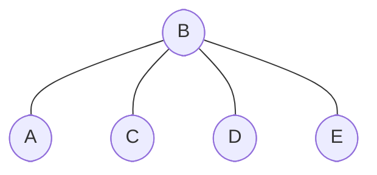

## Intro to Depth-First Search

The **Depth-First Search (DFS)** algorithm, also known as the 'maze explorer', is a master key to various graph-related challenges in fields ranging from computer networking to genetic genealogy.

One of the hallmarks of **DFS** is _its penchant for penetrating as far as possible into a graph along a route before retracing its steps (or backtracking) when it reaches an endpoint_. Then it delves into the next available route. It can be visualized as exploration within a network of caves, where each cave has multiple tunnels. You choose a tunnel, traverse as far as you can until you reach a dead end, return, choose another unexplored tunnel, and continue this process until no path is left unexplored.

## Understanding DFS

**Depth-First Search** or **DFS** is an algorithmic solution for traversing or searching through tree data structures or graph nodes. Its strategy of diving as deep as possible into a graph's branch before backtracking inspired its nomenclature.

Let’s visualize a familiar scenario for a moment. Suppose we're playing a video game situated in a complex map, loaded with winding paths and hidden rooms. You opt for a path and continue walking until you encounter a dead end. What's the next move? You revert, select another available path, and persist with this procedure until all possible paths are traversed — that’s **DFS** for you!

To better understand **DFS** within a graph context, consider this graph:



Here's how **DFS** explores the graph: `A > B > D > E > C`. **DFS** proceeds from `A` to `B`, then advances from `B` to `D`. As `D` has no unvisited adjacent nodes, **DFS** backtracks to `B` and resumes the traversal towards `E`. When all adjoining nodes from `E` are visited, **DFS** backtracks to `B` once again and finally advances towards `C`.

## DFS Algorithm

Now, let's discover the **DFS** algorithm! It primarily initiates at the root or the start **Node** of a **Graph** plunges as far as feasible down a branch, and then backtracks when it cannot delve further _(i.e., it arrives at a **Node** with no unvisited adjacent **Nodes**)_.

Here's a high-level pseudocode illustration of the **DFS** algorithm to ease our discussion:

```txt
1. Mark the current `node` as 'visited' and print the `node`.
2. For every adjacent unvisited `node` of the current `node`:
  2.1. Invoke the recursive DFS function.
```

Discussing **DFS's** time and space complexity is pivotal to understanding an algorithm's efficiency. The time complexity of **DFS** is <em class="math">O(V+E)</em>, where <em class="math">V</em> indicates the number of **Vertices**, and <em class="math">E</em> represents the number of **Edges** _(connections between **Vertices**)_ in the **Graph**. The space complexity is <em class="math">O(V)</em>, considering the storage of the visited **Nodes**.

## Implementation of DFS

```python
def DFS(graph, start, visited):
    visited.add(start)
    print(start, end=' ')

    for next_node in graph[start]:
        if next_node not in visited:
            DFS(graph, next_node, visited)


graph = {
  'A': set(['B', 'C']),
  'B': set(['A', 'D', 'E']),
  'C': set(['A']),
  'D': set(['B']),
  'E': set(['B']),
}

visited = set()
DFS(graph, 'A', visited)  # Output: A B D E C
```

In this Python code, we define a recursive function `DFS()`, taking three parameters — `graph`, `start`, and `visited`. The set `visited` keeps track of all visited **Nodes**. We commence from the `start` **Node** and add it to `visited`. For any `next_node` in the adjacency list of `start` that is not yet visited, we recursively invoke `DFS()`.

## Analyzing DFS

**DFS's** versatility makes it a powerful tool with a broad spectrum of applications. On a higher level, **DFS** _excels in problems related to the establishment of connections within **Graphs** and the discovery of pathways between two **Nodes**_. In terms of time efficiency, **DFS** thrives on densely connected **Graphs** where the probability of finding the target quickly exceeds that of **BFS**.

However, all tools have their limitations and nuances. **DFS** _does **not** perform optimally in problems necessitating the shortest path_, such as GPS routing problems, where **BFS** is a superior choice. Additionally, **DFS** requires careful management when dealing with cycles within the **Graph**, as it could end up in an infinite loop without effective control over the visited **Nodes**.

## Application of DFS to Real-life Scenarios

Having mastered the **DFS** algorithm, let's delve into its real-world applications. One significant application of **DFS** is in the domain of computer games. Envision a scenario where you are an explorer venturing through a mythical jungle in search of sacred artifacts scattered across a complex network of trails filled with obstacles and rewards. To ensure a unique route is chosen each time, the game could employ **DFS** to steer your game character through the virtual jungle.

Another intriguing application of **DFS** lies within the social network domain. **DFS** algorithms could navigate a connection web from a known user to an unknown user. Using **DFS**, developers can innovate a feature showcasing how two users are connected through mutual connections on the platform, similar to LinkedIn's feature that displays how a user is connected to another user through mutual connections.

## DFS for Cycle Detection

One practical use of **DFS** is determining whether a **Graph** contains a cycle. If we encounter a previously visited **Node** while executing **DFS**, then a cycle exists in the **Graph**.

For instance, consider the following **Graph**:

```txt
┌───╮    ┌───╮    ┌───╮
│ A │────│ B │────│ D │
└───╯    └───╯    └───╯
    ╲    ╱   ╲
    ┌───╮    ┌───╮
    │ C │────│ E │
    └───╯    └───╯
```

Exploring the **Graph** starting at `A` using **DFS**, our path would be `A > B > D > E > C`. On arriving at **Node** `C` and checking its neighbors, we find that `A` and `E` have already been visited, which suggests a cycle in the **Graph**.

## DFS for Pathfinding

**DFS** can also be deployed for pathfinding. Suppose we have a maze represented as a **Graph**, and the goal is to find a **Path** from one corner to another. The **DFS** algorithm would enable exploration of **Paths**, selecting a **Path**, and following it to the farthest point until a dead-end is reached before reverting and attempting the next available **Path** until the destination is reached. Each move marks the **Node** as visited and the **Path** taken is retained.

However, while **DFS** can help locate a **Path**, it does not guarantee the most efficient or shortest **Path**. In scenarios requiring the shortest **Path**, we would utilize another algorithm, like **BFS** or **Dijkstra's algorithm**.
